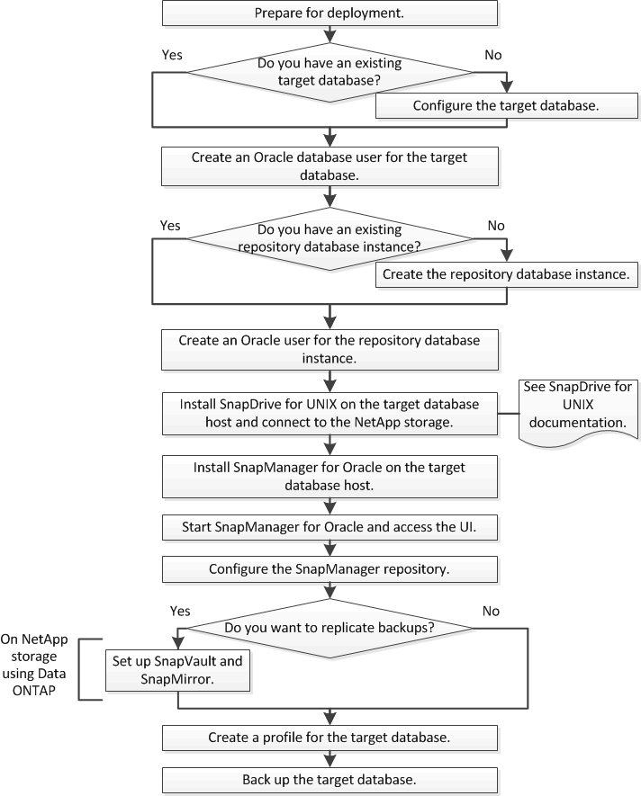

= Flux de travail de déploiement
:allow-uri-read: 
:icons: font
:imagesdir: ../media/

[role="lead"]
Avant de pouvoir créer des sauvegardes avec SnapManager, vous devez d'abord installer SnapDrive pour UNIX, puis installer SnapManager pour Oracle.

