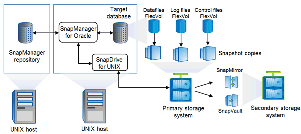

= Architecture SnapManager
:allow-uri-read: 
:icons: font
:imagesdir: ../media/

[role="lead"]
SnapManager pour Oracle comprend des composants qui fonctionnent ensemble pour fournir une solution complète et puissante de sauvegarde, de restauration, de restauration et de clonage pour les bases de données Oracle.

== SnapDrive pour UNIX

SnapManager requiert SnapDrive pour établir la connexion avec le système de stockage. Vous devez installer SnapDrive pour UNIX sur chaque hôte de base de données cible avant d'installer SnapManager.

== SnapManager pour Oracle

Vous devez installer SnapManager pour Oracle sur chaque hôte de base de données cible.

Vous pouvez utiliser l'interface de ligne de commande ou l'interface utilisateur à partir de l'hôte de base de données sur lequel SnapManager for Oracle est installé. Vous pouvez également utiliser l'interface utilisateur SnapManager à distance en utilisant un navigateur Web depuis n'importe quel système exécuté sur un système d'exploitation pris en charge par SnapManager.

NOTE: Les versions JRE prises en charge sont 1.5, 1.6, 1.7 et 1.8.

== Base de données cible

La base de données cible est une base de données Oracle que vous souhaitez gérer à l'aide de SnapManager en effectuant des opérations de sauvegarde, de restauration, de restauration et de clonage.

La base de données cible peut être un RAC (Real application clusters) autonome ou résider sur des volumes ASM (Automatic Storage Management) d'Oracle. Pour plus d'informations sur les versions, les configurations, les systèmes d'exploitation et les protocoles pris en charge de la base de données Oracle, consultez la matrice d'interopérabilité NetApp.

== Référentiel SnapManager

Le référentiel SnapManager réside dans une base de données Oracle et stocke les métadonnées sur les profils, les sauvegardes, la restauration, la restauration et le clonage. Un référentiel unique peut contenir des informations sur les opérations effectuées sur plusieurs profils de base de données.

Le référentiel SnapManager ne peut pas résider dans la base de données cible. La base de données de référentiel SnapManager et la base de données cible doivent être en ligne avant d'effectuer des opérations SnapManager.

== Système de stockage primaire

SnapManager sauvegarde les bases de données cibles sur le système de stockage principal de NetApp.

== Système de stockage secondaire

Lorsque vous activez la protection des données sur un profil de base de données, les sauvegardes créées par SnapManager sur le système de stockage primaire sont répliquées sur un système de stockage NetApp secondaire à l'aide des technologies SnapVault et SnapMirror.

*Informations connexes*

http://mysupport.netapp.com/matrix["Matrice d'interopérabilité NetApp"]
